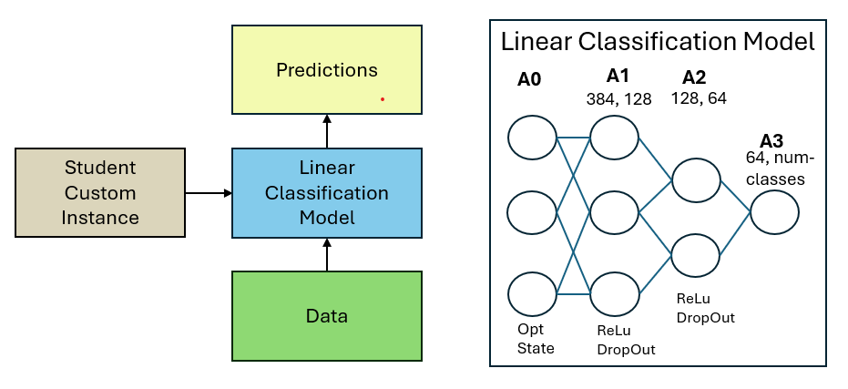
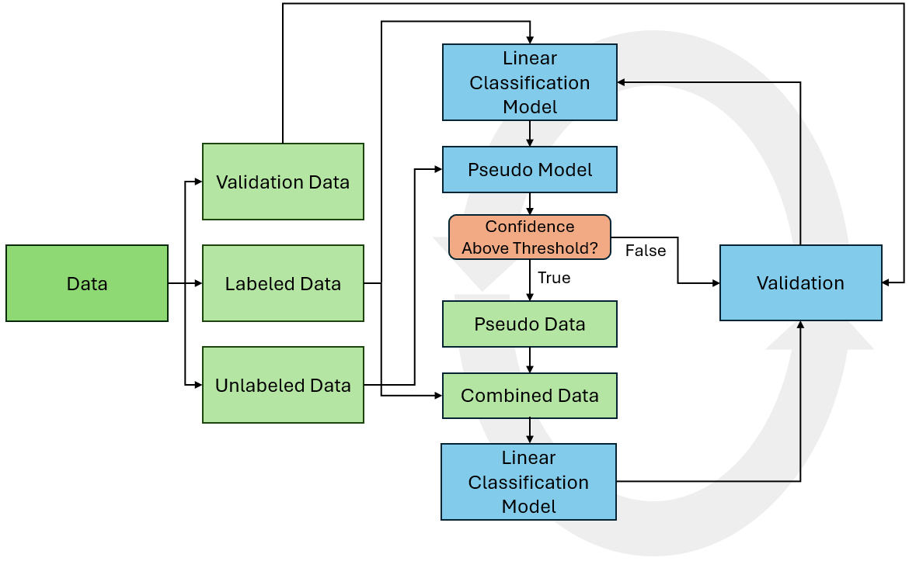

# Transforming Vision: Model Proposal Leveraging Transformer Architectures for Semi-Supervised Image Classification

## Overview
This project develops two novel semi-supervised image classification models leveraging transformer architectures. The models, ST-Class and SSL-ST-Class, utilize a Student Teacher network for initialization, employing techniques like Knowledge Distillation and Pseudo-Labels to enhance learning from limited labeled data. The aim is to achieve high accuracy and confidence in classifications while being data-efficient.

## Table of Contents
- [Overview](#overview)
- [Installation](#installation)
- [Model Architecture](#model-architecture)
- [Results](#results)
- [Acknowledgements](#acknowledgements)
<!-- [Contributing](#contributing)-->
<!-- [License](#license)-->

### Background
Current supervised learning methods demand extensive labeled datasets, which are costly and time-consuming to produce. Semi-supervised approaches like SSL-ST-Class reduce this requirement significantly, leveraging both labeled and unlabeled data to train models. This project builds on the capabilities of transformers, as discussed in Dosovitskiy et al. (2021) and Touvron et al. (2021), to address these challenges effectively.

### Background
Current supervised learning methods demand extensive labeled datasets, which are costly and time-consuming to produce. Semi-supervised approaches like SSL-ST-Class reduce this requirement significantly, leveraging both labeled and unlabeled data to train models. This project builds on the capabilities of transformers, as discussed in Dosovitskiy et al. (2021) and Touvron et al. (2021), to address these challenges effectively.

## Installation

### Setup Instructions
**Clone the repository**

git clone [https://github.com/Username/SSL-ST-Classification.git](https://github.com/RasmuskjaerN/SSL-ST-Classification.git)

**Navigate into the project directory**

cd projectname

**Install dependencies**

pip install -r requirements.txt

### Usage

**Running the Application**
python main.py

## Documentation

### Code Structure
The project is structured into several modules:

- student_teacher_model.py: Implements the Student Teacher architecture.
- data_loader.py: Handles data preprocessing and loading.
- training.py: Contains the training loops for both ST-Class and SSL-ST-Class models.
- evaluation.py: For performance evaluation and metrics visualization.

## Architecture and Environment
 
### Model Architecture

Our project leverages a Student-Teacher architecture using transformers, which enhances semi-supervised learning by utilizing pre-trained models to reduce training time and computational resources. Below we detail the architecture of our primary models:

**Student-Teacher Learning**

The Student-Teacher methodology exploits the pre-trained Vision Transformer (ViT) to guide the DeiT (Data-efficient Image Transformer) student model. This setup utilizes relational knowledge distillation where the student model learns optimized feature representations from the teacher, significantly enhancing the model's efficiency and predictive power. The integration of a linear classification layer allows the student model to adapt these features to new datasets with minimal training.

**_ST-Class Model:_** Initializes with pre-trained student model weights and applies linear layers to predict image classes effectively.

**_SSL-ST-Class Model:_** Extends the ST-Class by integrating pseudo-labeling and self-training, further reducing the need for labeled data.

**Visualizing Model Architecture**

Below are diagrams depicting the configurations of our models, showing how different components interact within the architecture.

  

  Figure 1: Student-Teacher Model Architecture

  

  Figure 2: Linear Classification Model Architecture

  

  Figure 3: SSL-ST-Class Architecture

### Environment Setup and Parallelization

Our models require substantial computational resources, handled through a combination of high-performance computing (HPC) and cloud resources:

**High-Performance Computing (HPC)**

Utilizing HPC allows us to leverage aggregated computing resources, achieving higher performance than possible with standalone systems. This setup is crucial for processing large datasets and complex model training routines efficiently.

**UCloud Integration**

We use UCloud, a cloud-based service providing access to HPC environments. This platform supports our intensive computational needs and facilitates the use of advanced development tools like Visual Studio Code directly within the cloud.

**Parallelization Strategy**

To optimize runtime, we implement both data and task parallelism using Python's multi-threading capabilities, distributing the workload across multiple Nvidia T4 GPUs, which significantly speeds up our training processes.

## Results
Performance is quantified through accuracy metrics on CIFAR10 and CIFAR100 datasets, showing that our models perform comparably to traditional methods with significantly reduced data requirements. Graphs and tables detailing these metrics are included in the project thesis COMING SOON.

  

  Figure 4: Accuracy and Loss plot on ST-Class on CIFAR100.

  

  Figure 5: Precision, Recall and F1 across Epochs ST-Class trained on CIFAR100

  

  Figure 6: Confusion matrix for CIFAR100.

## Discussion
While the ST-Class model reaches an accuracy of 93.37% on CIFAR10 and 71.32% on CIFAR100, the SSL-ST-Class model achieves 89.44% and 47.52%, respectively. These results validate the effectiveness of semi-supervised learning models in utilizing less labeled data.

<!--## Contributing
How to Contribute
Encourage others to contribute to your project by explaining how they can do so. Provide guidelines for submitting issues, pull requests, and code review standards.-->

## Acknowledgements
We would like to firstly express our sincerest gratitude to our advisor Professor Hua Lu for his invaluable guidance throughout ups and down. We appreciate all your thoughfull feedback and truly couldn’t have done without it.

We extend our appreciation to the eScience Center at the University of Southern Denmark. All of the computation done for this project was performed on the UCloud interactive HPC system, which is managed by the eScience Center at the University of Southern
Denmark. We have been granted the generous DeiC-RUC-L1-202403 grant. A special thanks to Jakub Klust, his assistance has been crucial in helping us to get started with and navigating through using UCloud.
